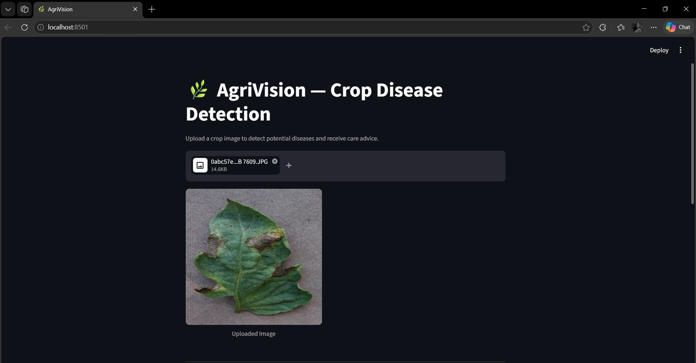
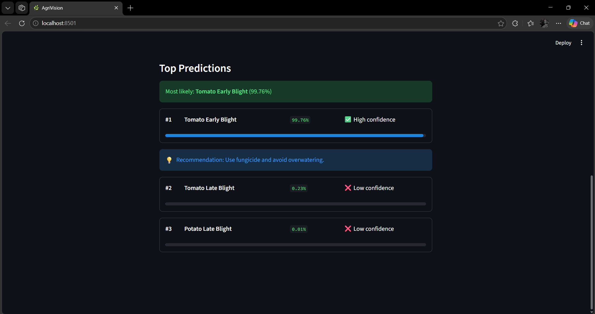
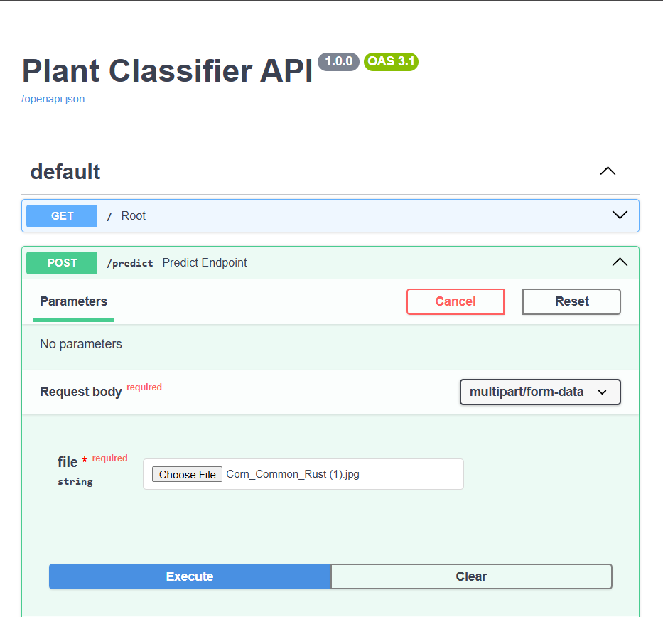
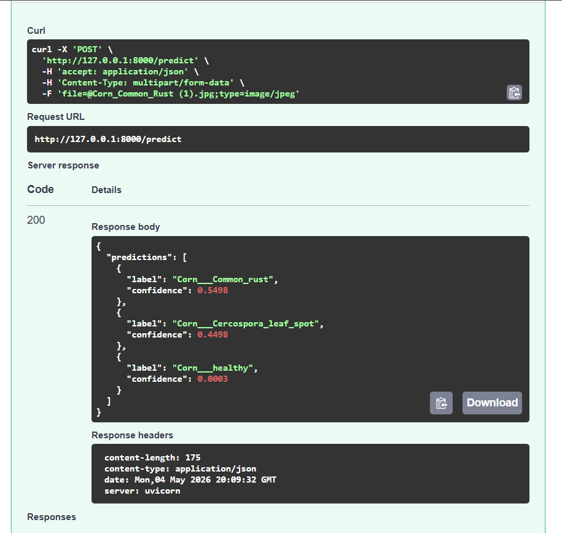

# 🌿 AgriVision — Crop Disease Detection & Advisory System

🚀 Built with PyTorch, FastAPI, and Streamlit for real-time crop disease detection.


An end-to-end AI-powered **decision support system** that detects crop diseases from leaf images and provides actionable treatment recommendations.

---

## 🎯 Problem

Crop diseases can significantly reduce yield, and early detection is crucial.
Manual diagnosis is time-consuming and requires expertise.

AgriVision provides an automated solution using deep learning for quick and accurate disease detection.

---

## 🚀 Features

* Multi-crop classification (**Tomato, Potato, Corn — 9 classes**)
* Top-3 predictions with confidence scores
* Interactive UI with image preview and confidence visualization
* Rule-based treatment recommendations
* FastAPI backend for real-time inference
* Model evaluation (confusion matrix, precision, recall, F1-score)

---

## 🧠 Model

* **Architecture**: Custom CNN (5 convolutional blocks)
* **Input Size**: 224 × 224 RGB
* **Dataset**: PlantVillage (curated subset)
* **Validation Accuracy**: **~98%**

---

## 📂 Project Structure

```text
agrivision/
├── backend/        # FastAPI server
├── frontend/       # Streamlit UI
├── models/         # CNN model, training, evaluation
├── inference/      # preprocessing + predictor
├── data/           # dataset
├── assets/         # screenshots
├── requirements.txt
└── README.md
```

---

## 📈 Key Results

* Achieved **~98% validation accuracy**
* Strong performance across all 9 classes
* Reliable top-3 predictions for ambiguous cases
* Deployed as a real-time system with API + UI integration

---

## 🧩 Tech Stack

| Layer     | Technology               |
| --------- | ------------------------ |
| ML        | PyTorch                  |
| Backend   | FastAPI, Uvicorn         |
| Frontend  | Streamlit                |
| Utilities | NumPy, scikit-learn, PIL |

---

## 🏗️ Architecture

```text
Streamlit UI  →  FastAPI (/predict)  →  PyTorch Model
                                       ├─ Softmax
                                       └─ Top-3 Predictions
```

---

## 📸 Screenshots

### 🌿 Streamlit UI

| Upload & Preview        | Predictions             |
| ----------------------- | ----------------------- |
|  |  |

---

### ⚙️ FastAPI (Swagger)

| Endpoint Testing          | API Response              |
| ------------------------- | ------------------------- |
|  |  |

---

## ▶️ How to Run

### 1. Clone repository

```bash
git clone https://github.com/snehapriy958/agrivision.git
cd agrivision
```

### 2. Setup environment

```bash
python -m venv venv
venv\Scripts\activate
pip install -r requirements.txt
```

### 3. Start backend

```bash
uvicorn backend.main:app --reload
```

### 4. Start frontend

```bash
streamlit run frontend/app.py
```

### Access

* UI → http://localhost:8501
* API → http://127.0.0.1:8000/docs

---

## 📊 Example Output

```json
{
  "predictions": [
    {"label": "Tomato___Early_blight", "confidence": 0.9989},
    {"label": "Tomato___Late_blight", "confidence": 0.001},
    {"label": "Tomato___healthy", "confidence": 0.0001}
  ]
}
```

---

## 🧪 Evaluation

* Confusion matrix and classification report
* Strong performance across all classes
* Minor confusion between visually similar diseases

---

## 💡 Future Improvements

* Transfer learning (EfficientNet)
* Grad-CAM for explainability
* Multi-language UI
* Batch prediction support

---

## 👤 Author

**Sneha — AIML Engineer**

---

## ⭐ If you like this project

Give it a star ⭐ and share your feedback!
